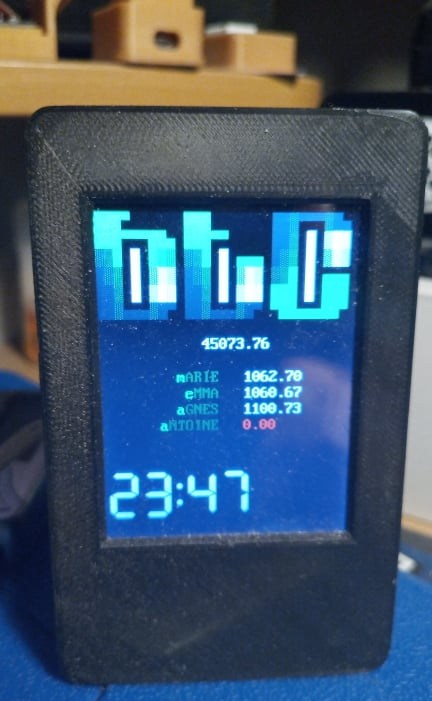

# ESP_ANSI_Art

ESP_ANSI_Art is a simple function/code that provide a DOS IBM437 Font and color @PCBoard syntax on ESP8266 / ESP32 / ARDUINO and  an LCD screen ( ie : ILI9341 )
 

## Installation

Nothing special (have a look at the provided code ;) )

FYI the code use TFT_eSPI lib

## Usage
simply add 


```c
#include <TFT_eSPI.h>
#include "font.h"
```

and use the provided PRINT or PRINTLN (print + Line Feed) functions.

```c
PRINT("Hello World");
//or
PRINT("@X0AHello World");  // Will output Bright Green on Black
//or
PRINT("@X1EHello World");  // Will output Bright Yellow on Bleu
```

Color command is simple : @Xab
where "a" is the background color and "b" the text color.

color code are : 

for the background : 
* 0 -> Black
* 1 -> Blue
* 2 -> Green
* 3 -> Cyan
* 4 -> Red
* 5 -> Magenta
* 6 -> Yellow
* 7 -> White

for the text : 
* 0 -> Black
* 1 -> Blue
* 2 -> Green
* 3 -> Cyan
* 4 -> Red
* 5 -> Magenta
* 6 -> Yellow
* 7 -> White
* 8 -> Bright Black (Gray)
* 9 -> Bright Blue
* A -> Bright Green
* B -> Bright Cyan
* C -> Bright Red
* D -> Bright Magenta
* E -> Bright Yellow
* F -> Bright White

you can naturally use the entire 255 charset of the DOS 437 FONT :
```c
PRINTLN("@X30░▒▓ @X0FHello World @X30▓▒░");
```

## Bonus
you can use the ANSIPOS function to place your "cursor" where you want before PRINT.
(home is 1,1 upper left corner).

```c
ANSIPOS(5,5);
PRINT("PRINT HERE");
ANSIPOS(2,7);
PRINT("OR HERE");
```

## Bonus 2 INFO
You can easily draw your ansi art using TheDraw ( under dosbox ) and save it at @PcBoard syntax.
After that simply convert your PCB file to UTF8 ;)

```bash
iconv -f IBM437 -t UTF-8 MyArt.PCB -o MyArt.PCB.UTF8
```


## Screenshots
 

## Contributing
Pull requests are welcome. For major changes, please open an issue first to discuss what you would like to change.

## License
[MIT](https://choosealicense.com/licenses/mit/)
